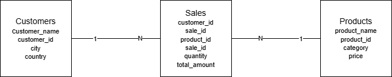
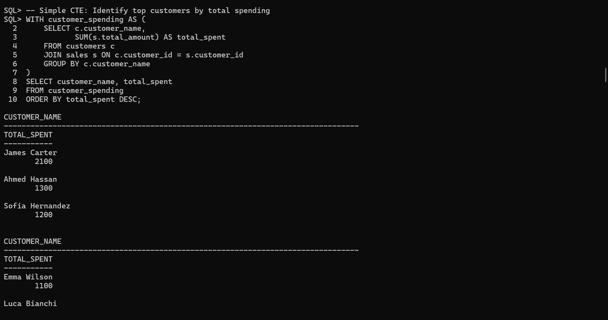
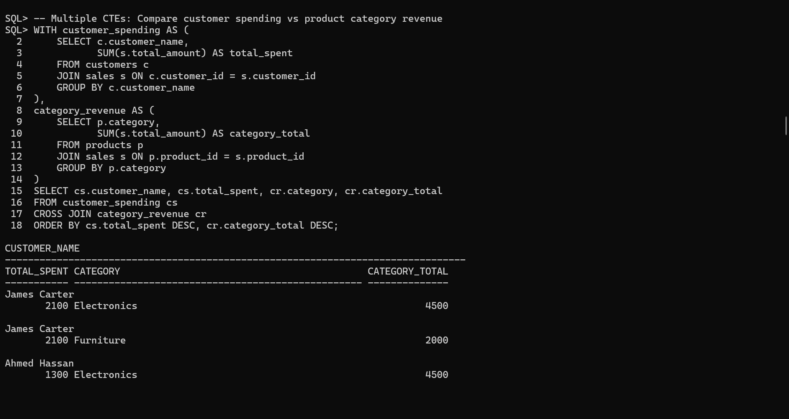
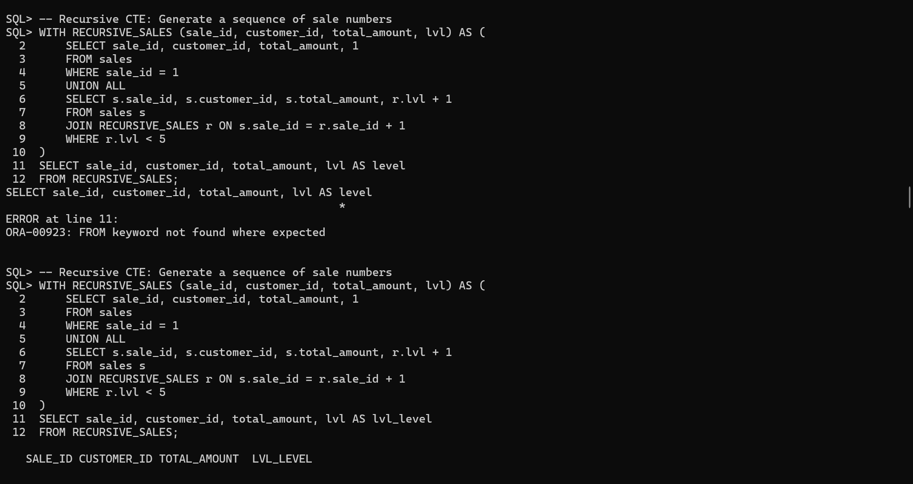
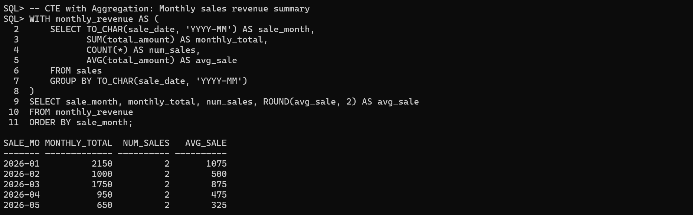
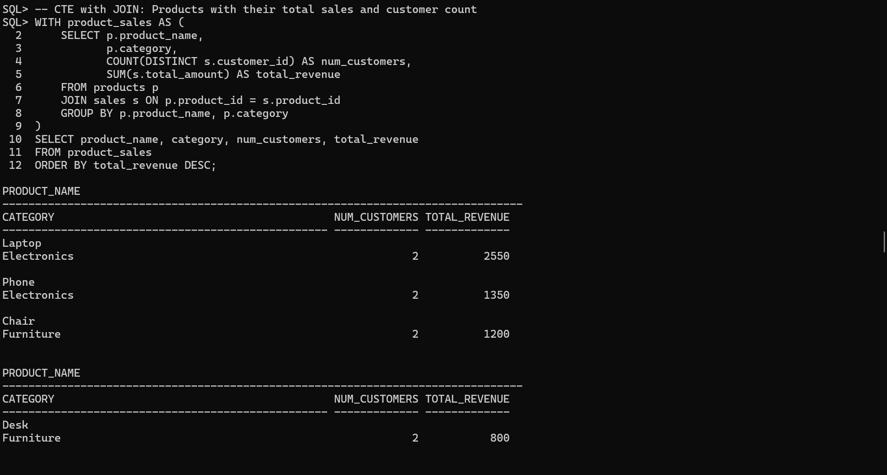
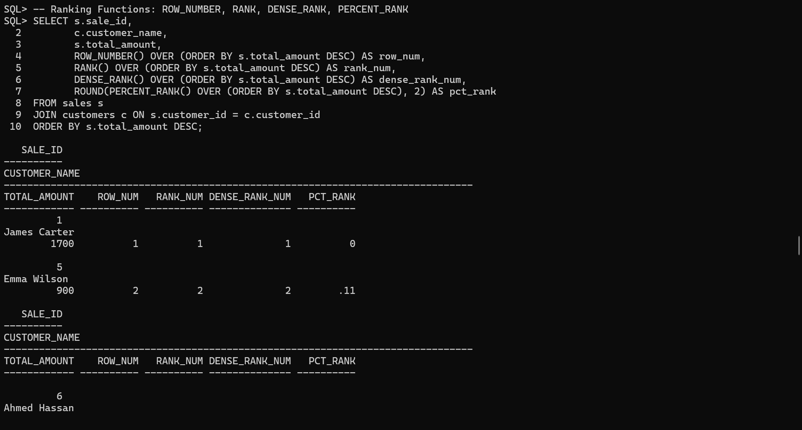
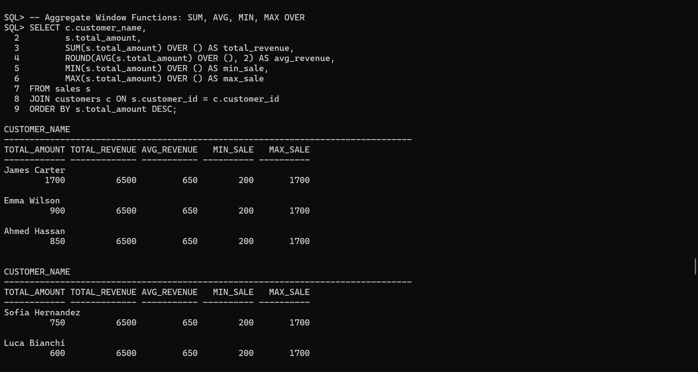
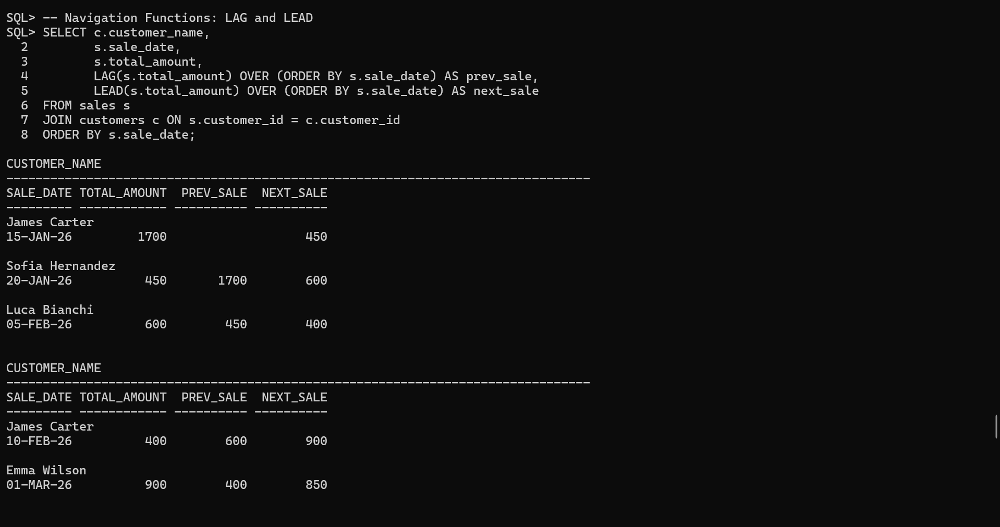
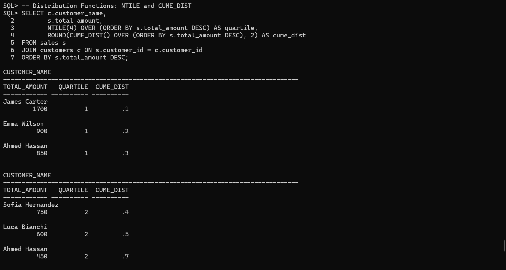

# CTEs & SQL Window Functions Project
**Course:** DPR400210 - Database Programming  
**Student:** Nadjitiessem | **ID:** 31603/2025  
**Instructor:** Eric Maniraguha  

---

## Business Problem

Many companies struggle to extract meaningful insights from raw sales data. This project implements a **Sales Management System** that uses advanced SQL techniques — Common Table Expressions (CTEs) and Window Functions — to analyze customer behavior, product performance, and revenue trends across time.

---

## Database Schema

Three related tables form the core of the system:

**CUSTOMERS** — stores customer identity and location  
**PRODUCTS** — stores product details and pricing  
**SALES** — records every transaction, linking customers and products  

### Relationships
- CUSTOMERS → SALES: One-to-Many (one customer can have many sales)
- PRODUCTS → SALES: One-to-Many (one product can appear in many sales)

---

## ER Diagram

---

## CTE Implementations

### CTE 1 — Simple CTE
Identifies top customers by total spending using a single CTE that aggregates sales per customer.  
**Business value:** Helps the sales team prioritize high-value customers for retention efforts.

---

### CTE 2 — Multiple CTEs
Combines two CTEs — one for customer spending and one for category revenue — using a CROSS JOIN to produce a combined view.  
**Business value:** Allows management to see how individual customer spending compares to overall category performance.

---

### CTE 3 — Recursive CTE
Traverses a chain of sales records sequentially starting from sale_id = 1, recursively joining each next sale until depth 5.  
**Business value:** Demonstrates how recursive CTEs can model sequential or hierarchical data such as order chains or approval workflows.

---

### CTE 4 — CTE with Aggregation
Groups sales by month and computes total revenue, number of sales, and average sale value per month.  
**Business value:** Enables trend analysis to identify peak and low-performing months for inventory and staffing decisions.

---

### CTE 5 — CTE with JOIN
Joins products and sales inside a CTE to calculate total revenue and unique customer count per product.  
**Business value:** Reveals which products generate the most revenue and attract the broadest customer base.

---

## Window Function Implementations

### Ranking Functions — ROW_NUMBER, RANK, DENSE_RANK, PERCENT_RANK
Ranks all sales transactions by amount in descending order using four different ranking approaches.  
**Business value:** Helps identify top-performing transactions and understand their relative standing in the overall sales distribution.

---

### Aggregate Window Functions — SUM, AVG, MIN, MAX OVER
Computes overall revenue benchmarks across all sales and displays them alongside each individual transaction.  
**Business value:** Allows instant comparison of any single sale against company-wide averages and extremes without a subquery.

---

### Navigation Functions — LAG and LEAD
Displays each sale alongside the previous and next sale amount ordered by date.  
**Business value:** Enables sales momentum analysis — identifying whether revenue is growing or declining over time.

---

### Distribution Functions — NTILE and CUME_DIST
Segments sales into quartiles and computes cumulative distribution for each transaction.  
**Business value:** Supports customer segmentation — grouping buyers into tiers (top 25%, middle 50%, bottom 25%) for targeted marketing.

---

## Analysis and Findings

### Descriptive Analysis — What happened?
- Total revenue across all sales: **6,500**
- Electronics generated significantly more revenue than Furniture
- January and March were the highest revenue months
- James Carter was the top-spending customer with 2,100 in total purchases

### Diagnostic Analysis — Why did it happen?
- Electronics dominance is driven by high-ticket items (Laptop at 850, Phone at 450)
- James Carter made two purchases including the highest single transaction (1,700)
- Revenue dipped in April–May likely due to lower-priced product purchases (Chair, Headphones)

### Prescriptive Analysis — What actions should be taken?
- Focus upselling efforts on Electronics category which drives 69% of revenue
- Offer loyalty incentives to top customers like James Carter and Ahmed Hassan
- Investigate low-revenue months (April–May) and consider promotional campaigns to boost sales

---

## References
- Oracle SQL Documentation: https://docs.oracle.com/en/database/oracle/oracle-database/19/sqlrf/
- Oracle Window Functions Guide: https://docs.oracle.com/en/database/oracle/oracle-database/19/sqlrf/Analytic-Functions.html

---

## Academic Integrity Statement

I confirm that this assignment represents my own original work. All SQL scripts were written and executed individually. All screenshots reflect my own database session. External resources consulted have been properly acknowledged above.
